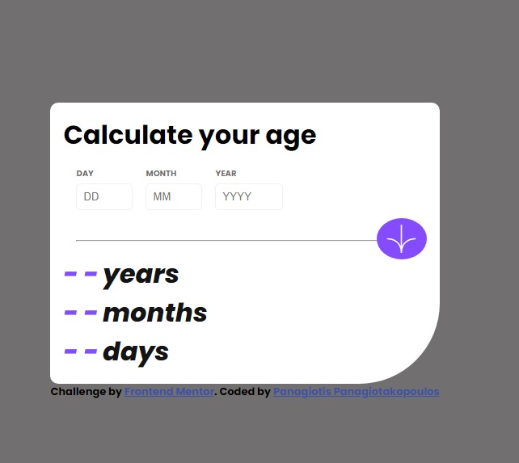

# Frontend Mentor - Age calculator app solution

This is a solution to the [Age calculator app challenge on Frontend Mentor](https://www.frontendmentor.io/challenges/age-calculator-app-dF9DFFpj-Q)


## Overview

Users should be able to:

- View an age in years, months, and days after submitting a valid date through the form
- Receive validation errors if:
  - Any field is empty when the form is submitted
  - The day number is not between 1-31
  - The month number is not between 1-12
  - The year is in the future
  - The date is invalid e.g. 31/04/1991 (there are 30 days in April)
- View the optimal layout for the interface depending on their device's screen size
- See hover and focus states for all interactive elements on the page
- See the age numbers animate to their final number when the form is submitted



### Links

- Solution URL: [Github repository](https://github.com/PanuGr/frontendmentor-challenges/tree/main/junior/age-calculator)
- Live Site URL: [Demo page](https://panugr.github.io/frontendmentor-challenges/junior/age-calculator/)

## My process

In order to achieve the validation rules mentioned above, I added some attributes to my input tags as shown below:

``````html
<input type="number" min="1" max="31" required 
title="Must be a valid day">
``````

- The input is required so the form cannot be empty
- The min/max attributes make sure that the date will be between 1-31
- The title gives some more clarity to the user if some mistake is made

These simple attributes solve many problems already.

However for more advanced validation I used javascript.
To check if the year is in the future i used the new Date method and simply compare the current year with the user's year:
``````js
const currentYear = new Date().getFullYear();
  if (inputs.value > currentYear) {
    errorMessages.innerText = "Must be in the past";
    return false;
  }
``````

To check if the date is correct I use again the new Date but this time I add the user's month and year and ask for the date. If the date matches the user's date, then it's the correct date:
``````js
function isValidDayInMonth(day, month, year) {
  const maxDaysInMonth = new Date(year, month, 0).getDate();
  return day <= maxDaysInMonth;
}
``````

It was quite tricky and challenging to get all the validations with javascript but I did it 🙂

## Author

- Website - [Codealagreek](https://codealagreek.netlify.app)
- Frontend Mentor - [@panugr](https://www.frontendmentor.io/profile/panugr)
