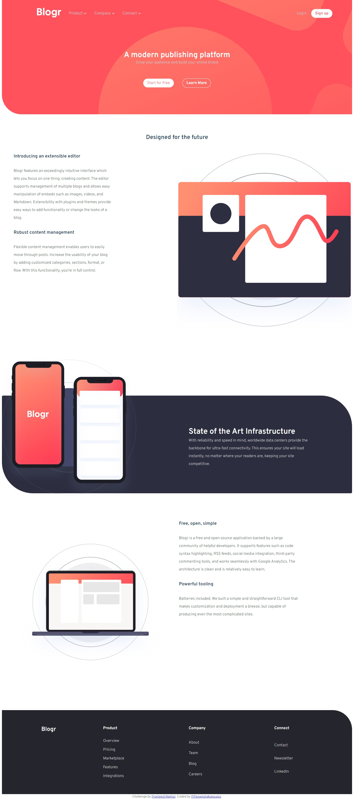

# Frontend Mentor - Blogr landing page solution

This is a solution to the [Blogr landing page challenge on Frontend Mentor](https://www.frontendmentor.io/challenges/blogr-landing-page-EX2RLAApP). Frontend Mentor challenges help you improve your coding skills by building realistic projects. 


## The challenge

Users should be able to:

- View the optimal layout for the site depending on their device's screen size
- See hover states for all interactive elements on the page

## Built with

- Semantic HTML5 markup
- SCSS variables
- Flexbox
- CSS Grid
- Mobile-first workflow

## My process
This project was more challenging than what I've done so far. 
I had to make a hamburger navigation, something that I don't usually do. I created a custom hamburger that toggles the menu on/off. Toggling happens with javascript. 

````javascript
 const navToggle = document.querySelector(".nav-toggle");
      navToggle.addEventListener("click", () => {
        document.body.classList.toggle("nav-open");
      });  
````
The navigation menu had dropdown menus. I created those dropdowns with the `details` tag. Why? Because it provides a built-in box that can be toggled on/off. 
No need to 'hide' content with css.

The main layout happens with a combination of grid and flexbox
````scss
 section:first-child {
      display: grid;
      grid-template-columns: repeat(6, 1fr);
      grid-template-rows: repeat(3, auto);
      align-items: stretch;
      h2 {
        grid-column: span 6;
        height: 5rem;
      }
      figure {
        grid-area: 2 / 4 / 3 / 8;
      }
      article {
        grid-area: 2 / 1 / 3 / 4;}}

````
On scss I wrote the style for mobile navigation on its own ``@media(max-width)`` and many styles for the desktop view are also in their own `@media (min-width)`

### Links

- Solution URL: [Github repository](https://github.com/PanuGr/frontendmentor-challenges/tree/main/junior/blog-landing-page)
- Live Site URL: [Github page](https://panugr.github.io/frontendmentor-challenges/junior/blog-landing-page)

### Author

- Website - [Panagiotis Panagiotakopoulso](https://panagiotis.netlify.app)
- Frontend Mentor - [@PanuGr](https://www.frontendmentor.io/profile/PanuGr)

### Screenshot
