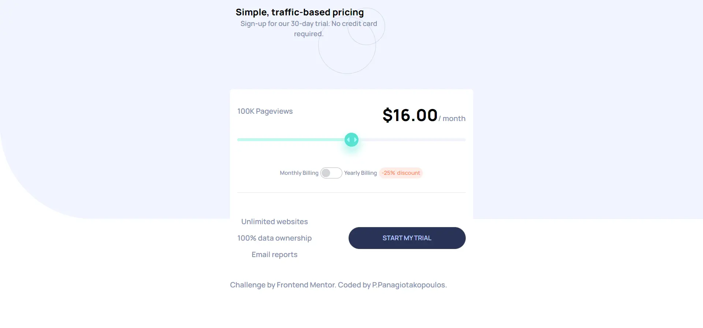

This is a solution to the *<ins>[Interactive pricing component challenge on Frontend Mentor](https://www.frontendmentor.io/challenges/interactive-pricing-component-t0m8PIyY8)</ins>*. 

## The challenge

Users should be able to:

- View the optimal layout for the app depending on their device's screen size
- See hover states for all interactive elements on the page
- Use the slider and toggle to see prices for different page view numbers



## Built with

- Semantic HTML5 markup
- Mobile-first workflow
- tailwindcss
- daisyui
- prettier 

## My process
Once again, I am working with tailwindcss to build this component.
This time I also use the daisyUi library. This is a library of popular components premade with tailwindcss. It speeds up the process and you can furthermore customize the components with tailwind classes.

In this project, the pricing input was quite a challenge, visually and programmatically.

Visually, `input` elements cannot be custom-styled as easily as other html elements. Basic styling can be applied straight to the `input` tag but the circle inside of the range requires a mix of `::-webkit`, `::-ms` and `::-moz` prefixes.
I only used the `webkit`, to avoid repetitive code. The component would look fine to most browsers. So the css looks like this:

```css
input[type="range"] {
  -webkit-appearance: none;
  appearance: none;
  width: 100%;
  height: 7px;
}

input[type="range"]::-webkit-slider-thumb {
  -webkit-appearance: none;
  appearance: none;
  height: 30px;
  width: 30px;
  border: none;
  border-radius: 50%;
  cursor: pointer;
}
```

Programmatically, it required multiple functions on the range input and the toggle so the prices would look correct.
The first price that the visitor sees is written with html but the rest are imported by javascript when the range changes.
Also, the background of the range changes through javascript

```js

const changePrice = (value) => {
        if (toggle.checked) {
            ...
            price.innerHTML = (pricelist[value] * 0.75).toFixed(2);
          }
          pageview.innerHTML = `${output.pageview[value]} Pageviews`;
      };

  rangeInput.oninput = function (e) {
    ...
        target.style.backgroundSize =
          ((value - min) * 100) / (max - min) + "% 100%";
        changePrice(value);
      };
```


### Useful resources

- *<ins>[Styling a range-input](https://nikitahl.com/style-range-input-css)</ins>* - This helped me to style the `input[type="range"]`.

### Links
- *<ins>[See the demo](https://panugr.github.io/frontendmentor-challenges/junior/interactive-pricing-component/)</ins>*
- *<ins>[See the code](https://github.com/PanuGr/frontendmentor-challenges/tree/main/junior/interactive-pricing-component)</ins>*
