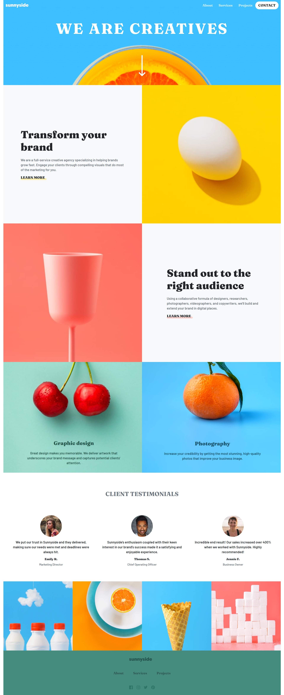

# Frontend Mentor - Sunnyside agency landing page solution

This is a solution to the [Sunnyside agency landing page challenge on Frontend Mentor](https://www.frontendmentor.io/challenges/sunnyside-agency-landing-page-7yVs3B6ef)

### The challenge

Users should be able to:

- View the optimal layout for the site depending on their device's screen size
- See hover states for all interactive elements on the page

### Screenshot

## My process
I took the opportunity to build this landing page with Bootstrap 5 (version used: 5.1.0). Using it and reading through the documentation
was quite easy. On my own scss file, I override bootstrap's default font-size, font-family and font-weight with the values from the challenge-style-guide. 
For the background of the navigation on mobile devices I used `clip-path:polygon()` and for the pictures of the main content I used `aspect-ratio:1/1`
so they would all be equal squares. 

### Built with

- Semantic HTML5 markup
- CSS custom properties
- Bootstrap 5
