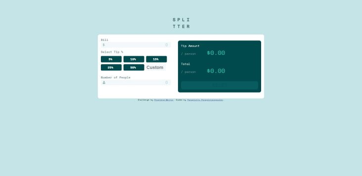

# Frontend Mentor - Tip calculator app solution
This is a solution to the [Tip calculator app challenge on Frontend Mentor](https://www.frontendmentor.io/challenges/tip-calculator-app-ugJNGbJUX). 

I had previously built a basic tip calculator but now I'm taking the opportunity to refactor my previous application using this challenge.

## The challenge

Users should be able to:

- View the optimal layout for the app depending on their device's screen size
- See hover states for all interactive elements on the page
- Calculate the correct tip and total cost of the bill per person

### Screenshot



## My process
On my html file I try to use as much as possible semantic html tags. I used labels before every input and I separated the calculator with a `fieldset`.

I wrote the css, using scss. I started with mobile first and then to higher viewports. The layout is simple and made with flexbox, so I didn't need many media queries (I only needed one).

I found out a new selector which modifies placeholders 😮
````scss
input[type="number"]::placeholder { color: var(--cyan); }
```` 
However the most important file is the javascript file 🙂
At first I thought that it'd be easy because I had already built a calculator before. However the design of this calculator was different, prompting new challenges to me 😆

I use few ``for...loops`` to continuously validate the form and paint the corresponded labels for my radio-inputs. That was harder than it sounds, because how do you find the parent of the radio tag!?
Luckily for me, i found this nice selector `closest()`:
````javascript
const tipsLabel = tip[i].closest('label');
```` 

Another cool selector is the `:checked`, which selects the radio input which has been selected. That was very useful when I wanted to add the tips into the calculation.
 ````javascript 
document.querySelector('input[name="tip"]:checked')
````
Finally I made a PWA version of this calculator. That wasn't part of the challenge but i thought it was a good opportunity. Reading the documentation for a PWA was overwhelming and difficult but, in my opinion I managed to make a satisfying application. 
## Built with

- Semantic HTML5 markup
- CSS custom properties
- SCSS
- Flexbox

## Links
- Solution URL: [Github repository](https://github.com/PanuGr/tip-calculator)
- Live Site URL: [Github pages](https://panugr.github.io/tip-calculator)

## Author
- Website - [Panagiotis Panagiotakopoulos](https://panagiotis.netlify.com)
- Frontend Mentor - [PanuGr](https://www.frontendmentor.io/profile/PanuGr)
- Linkedin - [Panagiotakopoulos](https://www.linkedin.com/in/p-panagiotakopoulos/)