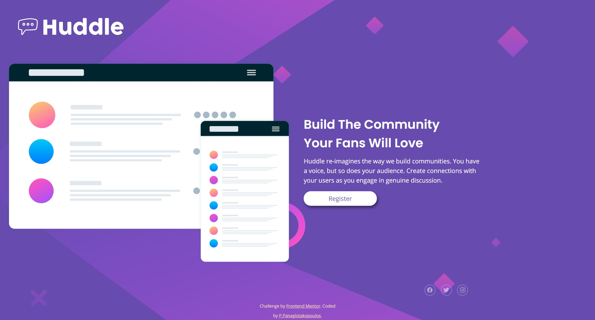

# Frontend Mentor - Huddle landing page

This is a solution to the [Huddle landing page with single introductory section challenge on Frontend Mentor](https://www.frontendmentor.io/challenges/huddle-landing-page-with-a-single-introductory-section-B_2Wvxgi0).

## Overview

A challenge for beginners, a project with a two-column layout.

### The challenge

Users should be able to:

- View the optimal layout for the page depending on their device's screen size
- See hover states for all interactive elements on the page

### Built with

- Semantic HTML5 markup
- CSS custom properties
- CSS Grid
- Mobile-first workflow
- [IonIcons](https://ionicons.com/) - An open source icons library

## My process

I started with the mobile layout as it is simpler.
The layout is made with grid. Logo, main content and footer are defined with `grid-template-rows: auto 1fr auto;`
The main content is divided in two columns automatically when the screen size is around 600px.I haven't use media queries for that.
It all works with `grid-template-columns: repeat(auto-fit, minmax(320px, 1fr));`

### Screenshot

### Links

- Solution URL: [Github repository](https://github.com/PanuGr/landing-page)
- Live Site URL: [Github pages](https://panugr.github.io/landing-page)

## Author

- Website - [Panagiotis Panagiotakopoulos](https://panagiotis.netlify.com)
- Frontend Mentor - [PanuGr](https://www.frontendmentor.io/profile/PanuGr)
- Linkedin - [Panagiotakopoulos](https://www.linkedin.com/in/p-panagiotakopoulos/)
