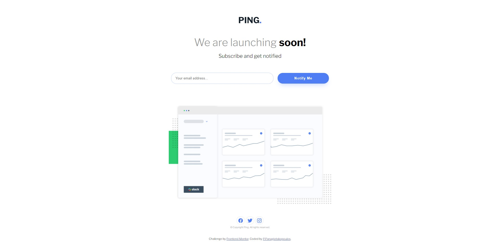

# Frontend Mentor - Ping coming soon page solution

# Documentation for Ping Coming Soon Page

## Overview

This project is a solution to the [Ping coming soon page challenge on Frontend Mentor](https://www.frontendmentor.io/challenges/ping-single-column-coming-soon-page-5cadd051fec04111f7b848da). The goal of this challenge is to create a responsive coming soon page where users can submit their email address. The page should display error messages if the email input is empty or incorrectly formatted.

## Used Technologies

- **HTML5**: Semantic HTML5 markup is used to structure the content of the page.
- **CSS3 / SCSS**: SCSS is used for styling the page, including Flexbox for layout.
- **JavaScript**: JavaScript is used for form validation to ensure the email input is correctly formatted.
- **IonIcons**: Open source icon library used for social media icons.
- **Google Fonts**: 'Libre Franklin' font is imported from Google Fonts for typography.

## Cool Features/Techniques Worth Mentioning

### Flexbox Layout

The layout of the page is created using Flexbox, which allows for a flexible and responsive design. Flexbox is used for centering and aligning elements, making it easier to create a layout that adjusts to different screen sizes.

```scss
form {
  margin: 2rem 0;
  display: flex;
  align-items: center;
  flex-direction: column;
  position: relative;
}
```

### Custom Form Validation

The form validation is handled using custom JavaScript to display error messages and styles when the email input is invalid. The messages are displayed dynamically based on the input validation.

```html
<form>
  <input type="email" name="email" id="email" placeholder="Your email address..." required aria-label="Type your email address">
  <p class="error-message"></p>
  <input type="submit" value="Notify Me" aria-label="Subscribe">
</form>
```

```javascript
const input = document.querySelector('input');

function validateEmail(email) {
  const re = /^(([^<>()[\]\\.,;:\s@"]+(\.[^<>()[\]\\.,;:\s@"]+)*)|(".+"))@((\[[0-9]{1,3}\.[0-9]{1,3}\.[0-9]{1,3}\.[0-9]{1,3}\])|(([a-zA-Z\-0-9]+\.)+[a-zA-Z]{2,}))$/;
  return re.test(String(email).toLowerCase());
}

function formValidation(e) {
  e.preventDefault();
  if (input.value === "") {
    document.querySelector('.error-message').innerHTML = 'Whoops! It looks like you forgot to add your email';
    document.querySelector('.error-message').style.visibility = 'visible';
  } else if (!validateEmail(input.value)) {
    document.querySelector('.error-message').innerHTML = 'Please provide a valid email address';
    document.querySelector('.error-message').style.visibility = 'visible';
  } else {
    location.reload();
  }
};
document.querySelector('input[type=submit]').addEventListener('click', formValidation);
```

### Mobile-First Workflow

The project is built with a mobile-first approach, ensuring that the design is responsive and looks good on all devices. Media queries are used to adjust the layout and styles for larger screens.

```scss
@media (min-width: 1000px) {
  form {
    flex-direction: row;
    justify-content: center;
    input[type="email"] {
      width: 30%;
    }
    input[type="submit"] {
      width: 15%;
      margin-left: 1rem;
    }
  }
  .error-message {
    top: 100%;
  }
  img:nth-child(5) {
    width: 50%;
    margin-top: 2rem;
  }
}
```

These techniques and features contribute to a well-structured, responsive, and user-friendly coming soon page.

### Screenshot


