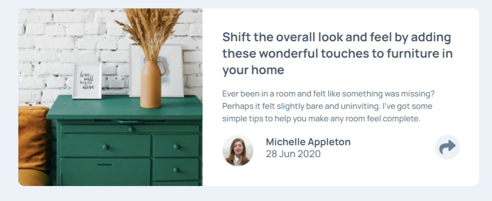

# Frontend Mentor - Article preview component solution

## Overview
This is a solution to the [Article preview component challenge on Frontend Mentor](https://www.frontendmentor.io/challenges/article-preview-component-dYBN_pYFT).
### The challenge

Users should be able to:

- View the optimal layout for the component depending on their device's screen size
- See the social media share links when they click the share icon

### Screenshot

### Links

- Solution URL: [Github repository](https://github.com/PanuGr/article-component)
- Live Site URL: [Github pages](https://panugr.github.io/article-component)

## My process
I started this project with the desktop design first. I am using grid layout and a bit of flexbox. 
To create the share-options element was challenging but eventually i got it to look as it should, and to be in the right place.
I wrote a javascript function that toggles the button and shows the share-options by applying some .css classes.
 
### Built with

- Semantic HTML5 markup
- Scss
- Flexbox
- CSS Grid
- Transitions
- Javascript
- Font Awesome

### What I learned
I had never before made a custom share-tooltip, so that was challenging and interesting. I also practiced transitions. 

### Continued development
Grid-layouts is something I should continue developing.
### Useful resources

- [Multiple contents in 1 grid-column](https://stackoverflow.com/questions/43311943/prevent-content-from-expanding-grid-items) - I found a hack to fit 2 elements in the same grid column, without having it in a flexbox wrapper.
- [Grid layouts](https://1linelayouts.glitch.me/) - This is an amazing site with few layout snippets.
- [Font Awesome](https://fontawesome.com) - An icon library that I use in this project.

## Author

- Website - [Panagiotis Panagiotakopoulos](https://panagiotis.netlify.com)
- Frontend Mentor - [PanuGr](https://www.frontendmentor.io/profile/PanuGr)
- Linkedin - [Panagiotakopoulos](https://www.linkedin.com/in/p-panagiotakopoulos/)