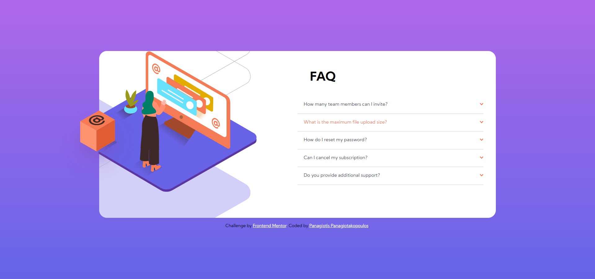

# Frontend Mentor - FAQ accordion card solution

### Screenshot


## Overview

This project is a solution to the [FAQ accordion card challenge on Frontend Mentor](https://www.frontendmentor.io/challenges/faq-accordion-card-XlyjD0Oam). The goal of this challenge is to create a responsive FAQ accordion card that adjusts to different screen sizes and includes interactive elements that reveal answers to questions when clicked.

## Used Technologies

- **HTML5**: Semantic HTML5 markup is used to structure the content of the page.
- **CSS3 / SCSS**: SCSS is used for styling the page, including Flexbox for layout and CSS Grid for centering the content.
- **Google Fonts**: 'Kumbh Sans' font is imported from Google Fonts for typography.

## Cool Features/Techniques Worth Mentioning

### Semantic HTML5 Tags

The FAQ accordion is built using semantic HTML5 tags such as `details` and `summary`. These tags are perfect for creating an accordion-like structure, as they provide built-in functionality for showing and hiding content.

```html
<details>
  <summary>How many team members can I invite?</summary>
  <p>You can invite up to 2 additional users on the Free plan. There is no limit on team members for the Premium plan.</p>
</details>
```

### SCSS for Styling

SCSS is used to style the page, leveraging variables, maps, and nesting to manage the styles efficiently. Colors are stored in a map array to keep the code clean and organized.

```scss
$colors: (
  blue: hsl(238, 29%, 16%),
  red: hsl(14, 88%, 65%),
  violet: hsl(273, 75%, 66%),
  lightblue: hsl(240, 73%, 65%),
  gray: hsl(237, 12%, 33%),
  lightgray: hsl(240, 6%, 50%),
  white: hsl(240, 5%, 91%),
);
```

### Responsive Design

The component is designed to be responsive and adjusts its layout based on the screen size. The mobile-first approach ensures that the design looks good on smaller screens and scales up for larger screens.

```scss
@media (min-width: 1024px) {
  main {
    margin-top: initial;
    padding-top: initial;
    width: 1024px;
    display: flex;
    justify-content: center;
    align-items: center;
    background-image: url("./images/bg-pattern-desktop.svg");
    background-repeat: no-repeat;
    background-size: fill;
    background-position: -990% 60%;
    position: relative;
    &::after {
      content: url("./images/illustration-box-desktop.svg");
      position: absolute;
      left: -100px;
      top: 9.5rem;
    }
  }
}
```

### CSS Flexbox and Grid

The layout is created using a combination of CSS Grid and Flexbox, allowing for a flexible and responsive design. CSS Grid is used to center the content, while Flexbox is used for aligning elements within the grid.

```scss
body {
  display: grid;
  place-content: center;
  height: 100vh;
  background-image: linear-gradient(
    map-get($colors, violet),
    map-get($colors, lightblue)
  );
  background-position: center;
  background-size: cover;
}

main {
  width: clamp(320px, 80vw, $mobile);
  padding: 2rem;
  margin-top: 5rem;
  padding-top: 5rem;
  border-radius: 20px;
  background-color: white;
  height: fit-content;
}
```

### Custom Styling for `details` and `summary`

The `details` and `summary` tags are styled using CSS to create a visually appealing accordion. The `::before` and `::after` pseudo-elements are used to add icons and background images.

```scss
details {
  border-bottom: 2px solid map-get($map: $colors, $key: white);

  summary {
    color: map-get($map: $colors, $key: gray);
    position: relative;
    padding: 1rem;
    outline: none;
    cursor: pointer;
    list-style-type: none;
    &:hover {
      color: map-get($colors, red);
    }
    &:active {
      font-weight: 700;
    }
    &::after {
      content: url("./images/icon-arrow-down.svg");
      position: absolute;
      right: 0;
    }
  }
  p {
    margin-left: 15px;
    padding-bottom: 1rem;
    line-height: 18px;
    max-inline-size: 45ch;
  }
}

details[open] {
  summary {
    font-weight: 700;
    &::after {
      transform: rotate(180deg);
    }
  }
  p {
    color: map-get($map: $colors, $key: lightgray);
  }
}
```

These techniques and features contribute to a well-structured, responsive, and user-friendly FAQ accordion card.
