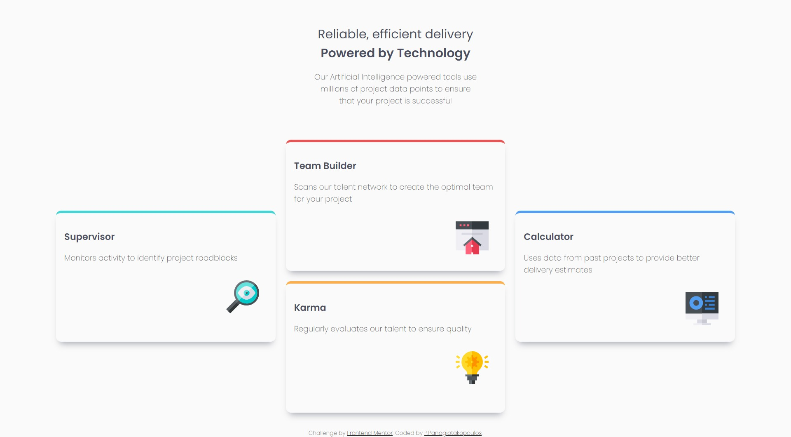

# Frontend Mentor - Four card feature section solution

### Screenshot


## Overview

This project is a solution to the [Four card feature section challenge on Frontend Mentor](https://www.frontendmentor.io/challenges/four-card-feature-section-weK1eFYK). The goal of this challenge is to create a responsive four card feature section that adjusts to different screen sizes and includes visually appealing elements.

## Used Technologies

- **HTML5**: Semantic HTML5 markup is used to structure the content of the page.
- **CSS3 / SCSS**: SCSS is used for styling the page, including CSS Grid for layout.
- **Google Fonts**: 'Poppins' font is imported from Google Fonts for typography.

## Cool Features/Techniques Worth Mentioning

### CSS Grid Layout

The layout of the feature section is created using CSS Grid, which allows for a flexible and responsive design. The grid-template-columns and grid-template-rows properties are used to create a grid layout, and each card is positioned manually within the grid.

```scss
main {
  display: grid;
  gap: 20px;
}

@media (min-width: 1000px) {
  main {
    grid-template-columns: repeat(3, 1fr);
    grid-template-rows: repeat(4, 1fr);
  }
  .div1 {
    grid-area: 1 / 2 / 3 / 3;
  }

  .div2 {
    grid-area: 3 / 2 / 5 / 3;
  }

  .div3 {
    grid-area: 2 / 1 / 4 / 2;
  }

  .div4 {
    grid-area: 2 / 3 / 4 / 4;
  }
}
```

### SCSS for Styling

SCSS is used to style the page, leveraging variables and maps to manage colors efficiently. The colors are stored in maps to keep the code clean and organized.

```scss
$primary: (
  Red: hsl(0, 78%, 62%),
  Cyan: hsl(180, 62%, 55%),
  Orange: hsl(34, 97%, 64%),
  Blue: hsl(212, 86%, 64%),
);
$neutral: (
  Dark-Blue: hsl(234, 12%, 34%),
  Grayish-Blue: hsl(229, 6%, 66%),
  Light-Gray: hsl(0, 0%, 98%),
);
```

### Mobile-First Workflow

The project is built with a mobile-first approach, ensuring that the design is responsive and looks good on all devices. Media queries are used to adjust the layout and styles for larger screens.

```scss
@media (min-width: 1000px) {
  h1 {
    font-size: x-large;
  }
  header p {
    max-width: 55ch;
  }
}
```

### Custom Borders and Shadows

Each card has a custom top border and box shadow, making the design visually appealing. The colors for the borders are taken from the SCSS color map.

```scss
article {
  border-radius: 10px;
  box-shadow: 0px 10px 13px -7px map-get($neutral, Grayish-Blue);
  padding: 1rem;

  p {
    padding-bottom: 1rem;
  }
}
.div1 {
  border-top: 5px solid map-get($primary, Red);
}

.div2 {
  border-top: 5px solid map-get($primary, Orange);
}

.div3 {
  border-top: 5px solid map-get($primary, Cyan);
}

.div4 {
  border-top: 5px solid map-get($primary, Blue);
}
```

### Useful Resources

- **[Shadow Generator](https://html-css-js.com/css/generator/box-shadow/)**: This site helps to visualize the box-shadow and creates a snippet of the desired result, saving time during development.
- **[Grid Generator](https://grid.layoutit.com/)**: This site allows you to draw the grid and the containers and see the code at the same time, making it easier to design complex grid layouts.

These techniques and features contribute to a well-structured, responsive, and visually appealing four card feature section.
