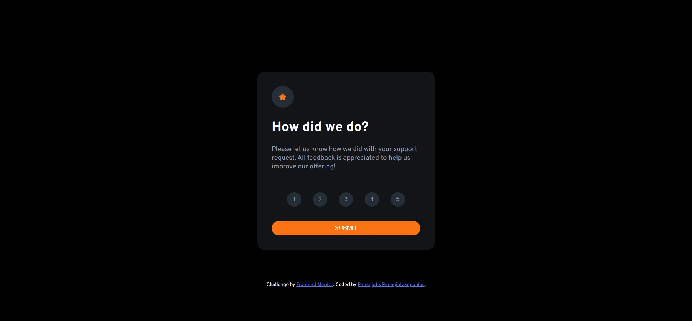

# Frontend Mentor - Interactive rating component solution


## Overview

This project is a solution to the [Interactive rating component challenge on Frontend Mentor](https://www.frontendmentor.io/challenges/interactive-rating-component-koxpeBUmI). The goal of this challenge is to create a responsive interactive rating component that allows users to rate a product or service and see a thank you message upon submission.

## Used Technologies

- **HTML5**: Semantic HTML5 markup is used to structure the content of the page.
- **CSS3 / SCSS**: SCSS is used for styling the page, including custom properties and a mobile-first workflow.
- **JavaScript**: JavaScript is used to handle the rating selection and submission, as well as to manage the dialog element.
- **Dialog Polyfill**: Used to provide support for the `<dialog>` element in browsers that do not support it natively.
- **Skypack**: A CDN used to import the dialog polyfill.

## Cool Features/Techniques Worth Mentioning

### `<dialog>` Element

The project uses the new `<dialog>` element to create a modal dialog box for the rating component. This element is mostly supported in modern browsers and provides built-in features for dialog behavior. A polyfill is used to ensure compatibility with browsers that do not support the `<dialog>` element natively.

```html
<dialog>
  <!-- Dialog content here -->
</dialog>
```

### Dialog Polyfill

To ensure the `<dialog>` element works in all browsers, a polyfill is imported from Skypack. The polyfill is registered with the dialog element to provide fallback functionality.

```javascript
import dialogPolyfill from "https://cdn.skypack.dev/dialog-polyfill";
const dialog = document.querySelector("dialog");
dialogPolyfill.registerDialog(dialog);
```

### SCSS for Styling

SCSS is used to style the page, leveraging variables and nesting to manage the styles efficiently. Custom properties are used for colors to keep the code clean and organized.

```scss
html {
  --orange: hsl(25, 97%, 53%);
  --white: hsl(0, 0%, 100%);
  --lightGray: hsl(217, 12%, 63%);
  --mediumGray: hsl(216, 12%, 54%);
  --blue: hsl(213, 19%, 18%);
  --darkBlue: hsl(216, 12%, 8%);
}
```

### Interactive Rating Selection

JavaScript is used to handle the rating selection and submission. When a star is clicked, the rating is stored, and a thank you message is updated with the selected rating.

```javascript
const stars = document.querySelectorAll('.rating');
const thankMessage = document.querySelector('.rating-result');
let rating;

stars.forEach(star => {
    star.addEventListener('click', () => {
        rating = star.value;
        thankMessage.innerText = `You selected ${star.value} out of 5`;
    });
});
```

### Form Submission and Thank You Message

When the submit button is clicked, the script checks if a rating has been selected. If not, it alerts the user to select a rating. If a rating is selected, the thank you message is displayed.

```javascript
const submitButton = document.querySelector('input[type="submit"]');
const thankMessageBlock = document.querySelector('main');

submitButton.addEventListener('click', () => {
    if (rating === undefined) {
        alert("Please select a rating");
        location.reload();
    }
    else {
        thankMessageBlock.style.visibility = 'visible';
    }
});
```

### Mobile-First Workflow

The project is built with a mobile-first approach, ensuring that the design is responsive and looks good on all devices. The main content is centered using CSS Grid.

```scss
body {
  max-width: 400px;
  margin: auto;
  font-size: 15px;
  font-weight: 400;
  background-color: black;
  display: grid;
  place-items: center;
  min-height: 100vh;
  font-family: overpass;
}
```

### Useful Resources

- **[The dialog element](https://developer.mozilla.org/en-US/docs/Web/HTML/Element/dialog)**: This MDN article explains the `<dialog>` tag and helped in understanding how to use it.
- **[Use dialog for the easiest way to modal](https://youtu.be/TAB_v6yBXIE)**: A quick tutorial video about the `<dialog>` element.

These techniques and features contribute to a well-structured, responsive, and user-friendly interactive rating component.
