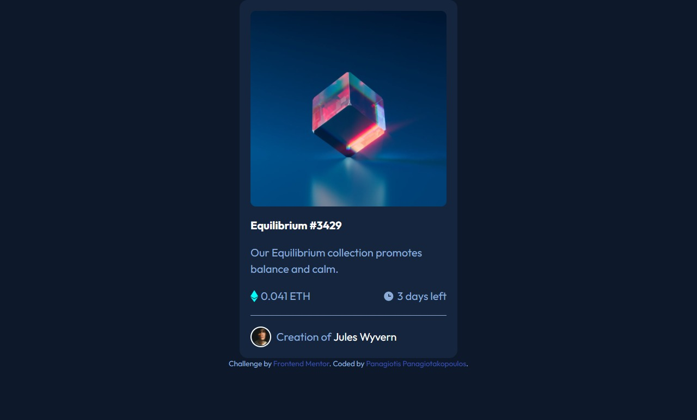

# Frontend Mentor - NFT preview card component solution

This is a solution to the [NFT preview card component challenge on Frontend Mentor](https://www.frontendmentor.io/challenges/nft-preview-card-component-SbdUL_w0U). Frontend Mentor challenges help you improve your coding skills by building realistic projects.

## Overview

### The challenge

Users should be able to:

- View the optimal layout depending on their device's screen size
- See hover states for interactive elements

### Screenshot



### Built with

- Semantic HTML5 markup
- Mobile-first workflow
- [Tailwind Css](https://tailwindcss.com) - Tailwind CLI

### Links

- [Gitgub repositroy:](https://github.com/PanuGr/frontendmentor-challenges/tree/main/newbie/ntf-card)
- [Live Site URL:](https://panugr.github.io/frontendmentor-challenges/newbie/ntf-card/)

## Author

- [Panagiotis Panagiotakopoulos-](https://panagiotis.netlify.app)
- Frontend Mentor - [@PanuGr](https://www.frontendmentor.io/profile/panugr)
- Github - [@panugr](https://www.github.com/panugr)

## My process

I am learning how to use Tailwind Css therefore this solution is built with Tailwind Css.

This time I am using the tailwind CLI method to install tailwind. The command generates a tailwind.config.js file,
in which I set the given style instructions(color,fonts) as tailwind's default. Then it was easy to use them as utility classes in my html.

`````js
 theme: {
    colors:{
      softBlue:"#8bacda",
      cyan:"#00fff7",
      blueMain:"#0d192b",
      blueCard:"#14253d",
      blueLine:"#2f415b",
      white:"#ffffff",
    },
    fontFamily: {
      outfit: ['Outfit', 'sans-serif']}

`````
Working with tailwind this time was relatively easier than the first time. The only time I had to write custom css was on 1 hover effect on the first `img` element.
I needed an overlay effect which I couldn't achieve with utility-classes, or at least that's what I think.
The overlay is achieved by using the `::after` pseudo-class:

`````css
 .overlay:hover::after{
        position: absolute;
        content: url("./assets/icon-view.svg");
        inset: 0;
        width: 288px;
        height: 288px;
        display: grid;
        place-content: center;
        background-color: cyan;
        opacity: .6;
      }
````
