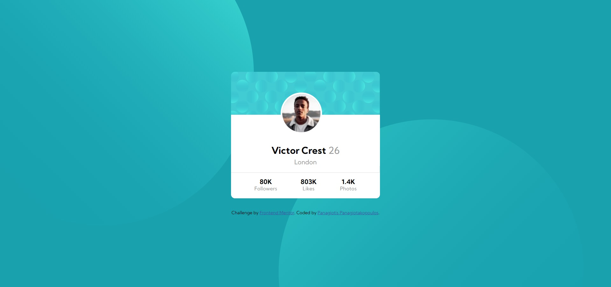

# Frontend Mentor - Profile card component solution

## Overview
This is a solution to the
[Profile card component challenge on Frontend Mentor](https://www.frontendmentor.io/challenges/profile-card-component-cfArpWshJ).

### Screenshot

## My process
For the background image, I set it up from my .css file as `background-image: url('image1'), url('image2')`.
For the main card, I divided it in a `header` with an img tag and the rest in a `section`. I position the image to the center with `translate()`.
The stats are a `ul` list displayed as flexbox. 
### Built with

- Semantic HTML5 markup
- SCSS variables & nesting
- Flexbox
- Mobile-first workflow

### What I learned

This has been the first time that i worked with svg. I didn't know much about that format. I also got the opportunity to work with positioning 2 background images at the same time.

### Continued development
I feel that svgs are something that I will have to learn and use again in the future.

### Useful resources

- [Controlling background-images](https://youtu.be/3T_Jy1CqH9k) - This helped me to understand how positioning 2 background-images works.
- [A beginners guide to SVG](https://youtu.be/ZJSCl6XEdP8) - This tutorial-video helped me understand the svg-concept.
