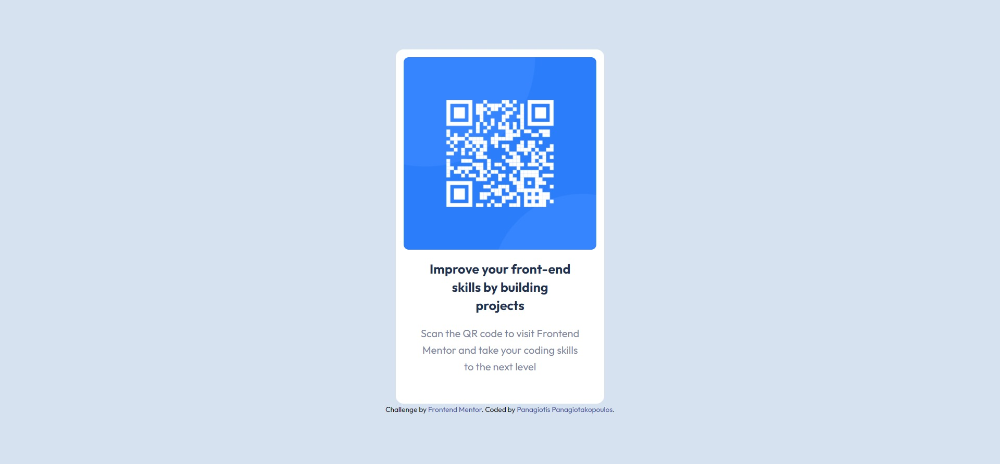

# Frontend Mentor - QR code component solution

This is a solution to the [QR code component challenge on Frontend Mentor](https://www.frontendmentor.io/challenges/qr-code-component-iux_sIO_H). Frontend Mentor challenges help you improve your coding skills by building realistic projects. 

## Overview

### Screenshot

### Built with

- Semantic HTML5 markup
- [Tailwind Css](https://tailwindcss.com/) - CDN

### Links

- [Github repository](https://github.com/PanuGr/frontendmentor-challenges/tree/main/newbie/qr-component)
- [Live Site URL](https://panugr.github.io/frontendmentor-challenges/newbie/qr-component/)

## My process
This is my first try at solving a challenge with Tailwind Css. 
Since I am new to Tailwind Css, I thought to start with the simplest way, using tailwind from the cdn.
As I learn more about Tailwind Css, I will try to use the other installation methods as well. 

## Author

- Website - [Panagiotis Panagiotakopoulos](https://panagiotis.netlify.app)
- Frontend Mentor - [@PanuGr](https://www.frontendmentor.io/profile/PanuGr)
- GitHub - [@PanuGr](https://github.com/PanuGr)